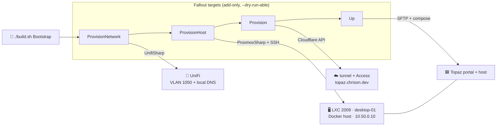

# Homelab.Stacks.Azure — local Azure stack (Fallout IaC)

[](https://github.com/Fallout-build/Fallout)
[](https://github.com/Chrison-Homelab/Homelab)

The homelab **Azure** stack: a local Azure environment emulated by
[Topaz](https://topaz.thecloudtheory.com), deployed to its own LXC with the
Portal exposed via a dedicated Cloudflare tunnel behind Access. The deploy is a
**Fallout** build (the NUKE hard-fork, `Fallout.Common` from nuget.org) — C#
targets, not shell — so it runs identically locally and on CI. Mounted as the
`stacks/Azure` submodule of the Homelab superproject.

The `Bootstrap` target reconciles the whole stack from bare metal in one chain —
every reconciler is **add-only / find-or-create** and `--dry-run`-able:



```
build/Build.cs            Provision/ProvisionNetwork/ProvisionHost/Up/Bootstrap targets
tools/Topaz.Deploy/       reconcile engine (Cloudflare/UniFi/Proxmox) + SSH deployer
azure-deploy.json         what to reconcile (zone, tunnel, ingress, Access, VLAN, LXC)
stack/                    the compose stack shipped to the LXC (host + portal + cloudflared)
local-dev/                OrbStack/Docker compose for local-only dev on your workstation
build.sh / .cmd / .ps1    bootstrap (restore + run the build project)
```

## Targets

| Target | Does |
|--------|------|
| `ProvisionNetwork` | Reconciles UniFi: find-or-create the **Azure Lab** network (VLAN 1050 / 10.50.0.0/16) and the `*.topaz.local.dev` **Local DNS** A-records → 10.50.0.10. |
| `ProvisionHost` | `DependsOn(ProvisionNetwork)`. Reconciles Proxmox: ensure the Debian template (`pveam download` if missing), find-or-create **LXC 2009** on desktop-01 (unprivileged, nesting+keyctl, VLAN 1050, static 10.50.0.10), start it, and install Docker over SSH. |
| `Provision` | Reconciles Cloudflare: find-or-create tunnel `topaz`, push ingress (`topaz.chrison.dev → portal:8080`), the proxied CNAME, and the **Access** app + allow policy. Emits the connector token. |
| `Up` (default) | `DependsOn(Provision)`, then SFTPs `compose.yml` + `certs/topaz.crt` + a fresh `stack.env` to the LXC and runs `docker compose` (pull → up host → refresh cert from the image → up the rest). |
| `Bootstrap` | **Fresh-hardware path.** `ProvisionNetwork → ProvisionHost → Provision → Up` in one shot. |

Every target honours `--dry-run` (plan + render, **zero writes**) — always the safe first step. All reconcilers are **add-only / find-or-create**: an existing VLAN (by id), DNS record (by domain), LXC (by vmid), tunnel, CNAME, or Access app is left untouched (NoOp). Nothing is ever modified or deleted.

### Fresh hardware, one chain

```sh
cd stacks/Azure
# creds (scoped) — Fallout reads these [Secret] params from env:
export UNIFI_API_KEY=...        UNIFI_BASE_URL=https://<gw>/proxy/network/integration
export PROXMOX_TOKEN_ID=...     PROXMOX_TOKEN_SECRET=...   PROXMOX_BASE_URL=https://<pve>/api2/json
export CLOUDFLARE_API_TOKEN=...
./build.sh Bootstrap --dry-run   # review the FULL plan (UniFi + Proxmox + Cloudflare + compose)
./build.sh Bootstrap             # apply it all
```

Prereqs the reconcilers assume (see "Needs confirmation" below): the switch port to the node trunks VLAN 1050, and the dev box can route to 10.50.0.10 for the SSH steps. (The Debian template is downloaded automatically if missing.)

## First-time setup

1. **Cloudflare token** (scope minimally to `chrison.dev`): `Account · Cloudflare Tunnel · Edit`, `Account · Access: Apps and Policies · Edit`, `Zone · DNS · Edit`, `Account · Account Settings · Read`. Export it before running (Fallout reads the `[Secret]` param from env, or prompts masked):
   ```sh
   export CLOUDFLARE_API_TOKEN=$(bw get password '<cloudflare-topaz-token>')
   ```
2. **UniFi + Proxmox creds** (only for `ProvisionNetwork`/`ProvisionHost`/`Bootstrap`): `UNIFI_API_KEY` + `UNIFI_BASE_URL`, and `PROXMOX_TOKEN_ID` + `PROXMOX_TOKEN_SECRET` + `PROXMOX_BASE_URL` (same names as the Homelab `secrets.env` — `set -a && . secrets.env && set +a`). Self-signed endpoints: set `UNIFI_VERIFY_TLS`/`PROXMOX_VERIFY_TLS=false`.
3. **Allowed Access emails** — edit `azure-deploy.json` → `Access.Apps[0].AllowEmails` (replace `you@example.com`). Not secret, so it lives in config.
4. **SSH key** — `azure-deploy.json` → `Lxc.SshPublicKeyFile` is injected into the LXC at create time; the matching private key is used for the Docker install + the `Up` deploy. Ensure `topaz-lxc` (or `10.50.0.10`) is reachable from your box.

## Deploy

```sh
cd stacks/Azure
# whole stack from bare metal:
./build.sh Bootstrap --dry-run     # review UniFi + Proxmox + Cloudflare + compose plan
./build.sh Bootstrap               # apply

# or just the app layer when the VLAN/LXC already exist:
./build.sh Up                      # = Provision (Cloudflare) + ship + compose up (the default target)
```

> All reconcilers are **add-only / find-or-create** and `--dry-run`-able — per the
> Homelab `CLAUDE.md`, nothing pre-existing is modified or deleted. Always run
> `--dry-run` first; the rendered plan shows every create before any write.

## Needs confirmation before a real apply

The reconcilers were built to the UniFi OpenAPI + Proxmox API but **not live-tested**
(writes would mutate shared infra). Verify on first `Bootstrap --dry-run`/apply:

1. **LXC template** — auto-downloaded via `pveam` if missing. The pinned filename (`debian-13-standard_13.1-2…` in `azure-deploy.json`) must still be in the Proxmox catalog; if it's aged out, bump the version string in `Lxc.Template`.
2. **VLAN trunk** — the switch port to `desktop-01` must trunk VLAN 1050 (UniFi "Allow All" trunks do by default).
3. **Routing** — your dev box must reach `10.50.0.10` (the Docker-install + `Up` SSH steps) across the new VLAN.
4. **DHCP defaults** — `DhcpStart/Stop` + lease/ping defaults in `azure-deploy.json` match working values; adjust to taste.
